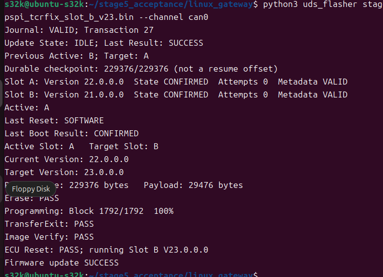
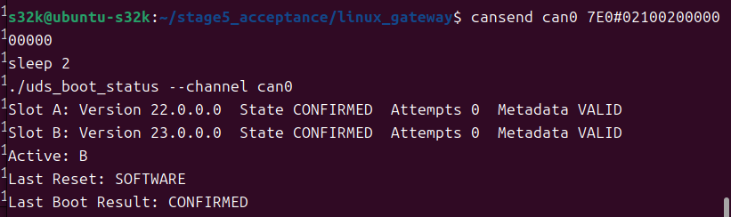

# 🚗 S32K144 Bootloader V2

<p align="center">
  
</p>
<p align="center">
  <b>能在线升级，也能在试运行失败后回到已确认固件的 S32K144 ECU。</b><br>
  A/B Slots · UDS · ISO-TP · RAM Flash Driver · Journal · Trial / Confirm / Rollback
</p>
<p align="center">
  
  
  
</p>

## 👋 这是什么？

这是 [S32K144 Automotive ECU](https://github.com/mianlongxu-cell/S32K144-Automotive-ECU)
的 V2 项目：在 FreeRTOS ECU 和 Linux SocketCAN 基础上，加入非运行槽更新、
RAM Flash Driver、双副本升级日志和持久化启动生命周期。

```text
Linux → UDS / ISO-TP → 更新非运行槽 → 校验 → Pending → Trial
                                                      ├─ 健康确认 → Confirmed
                                                      └─ 失败上限 → Invalid → 回滚
```

## ✨ 能做什么？

- A/B 在线升级：完整 packed image、Header 最后发布、版本递增及运行槽保护。
- 掉电恢复：双副本 Journal、CRC、提交标记；中断后完整重刷，不提供断点续传。
- 生命周期：Trial 计数、健康确认、看门狗/HardFault/复位循环失败回滚。
- CAN 诊断：请求 `0x7E0`，响应 `0x7E8`，支持 ISO-TP 多帧。
- UJA1169 SBC 初始化：LPSPI1 使能后配置 TCR，已验证冷启动。
- FreeRTOS ECU：车辆信号、DEM/DTC、周期 CAN、Linux 监视及 CSV 日志。

## 🗺️ Flash 布局

| 区域 | 地址范围 | 用途 |
|---|---|---|
| Bootloader | `0x00000–0x07FFF` | 启动与编程服务 |
| Slot A | `0x08000–0x3FFFF` | Header：`0x3F000` |
| Slot B | `0x40000–0x77FFF` | Header：`0x77000` |
| Journal | `0x78000–0x79FFF` | 双副本升级日志 |
| Metadata | `0x7A000–0x7DFFF` | A/B 各两份生命周期记录 |
| 保留 | `0x7E000–0x7FFFF` | 保留空间 |

详见 [内存布局](docs/bootloader_v2/memory_map.md)。V1 单槽组合镜像不适用于 V2。

## 🧪 Stage5 实机验收

**表内 11 项功能验收全部通过。** 最终 A22、B23 均为 CONFIRMED、Attempts 0，当前选择 B。
两个镜像均通过脱离调试器的冷启动查询；完整 512 KiB PFlash 已核验。

<p align="center">
  
  
</p>

- NO_CONFIRM、看门狗、HardFault、复位循环达到上限后回滚；延迟确认期间真实断电后恢复。
- Journal 事务 28：IDLE/SUCCESS；最终镜像逐字节匹配，CRC 和 Metadata 均有效。
- 软件回归：Stage2 25 项、Stage3 编程/UDS、Stage4 792 断言、ISO-TP 11 项、Stage5 382 断言、Linux 50 项。

详见 [验收报告](docs/bootloader_v2/stage5_acceptance_report.md) 与
[SHA-256 清单](docs/bootloader_v2/stage5_artifact_sha256.txt)。

## 🧰 构建

按 [依赖说明](docs/build_and_vendor_files.md) 恢复本地 NXP 文件，并配置 Arm GNU、
Node.js、Python、原生 GCC 路径，然后运行：

```powershell
./tools/build_stage5.ps1 -VersionA 22.0.0.0 -VersionB 23.0.0.0
```

脚本构建 Bootloader、A/B 应用、故障模式并运行回归。正常 packed image 位于
`Application_Build/Stage5/APP_A/app_slot_a_image.bin` 和
`Application_Build/Stage5/APP_B/app_slot_b_image.bin`。
升级版本必须高于当前版本；运行 B23 的板子不能再用 A22/B23 正常升级。

## 🐧 Linux 使用

```bash
cd linux_gateway
./scripts/setup_can.sh can0 500000
candump -L can0
```

另一终端查询槽位和版本：

```bash
cansend can0 7E0#0322F10100000000
cansend can0 7E0#0322F10200000000
```

当前运行 A 时刷入更高版本 B 槽 packed image：

```bash
python3 uds_flasher /path/to/newer_slot_b_image.bin --channel can0
```

F105 仅在 Bootloader 编程模式支持，查询前执行：

```bash
cansend can0 7E0#0210020000000000
sleep 2
python3 uds_boot_status --channel can0
```

调试器复位捕获会暂停 CPU，影响刷写确认；独立冷启动验收应断开调试连接。

## 📁 仓库地图

```text
Bootloader/          启动、刷写、Journal、Metadata、回滚
FlashDriver/         SRAM Flash Driver
src/                 FreeRTOS ECU、诊断、UJA1169
include/             接口和本地设备支持
Project_Settings/    S32DS 启动与链接配置
linux_gateway/       SocketCAN、UDS、刷写器、测试
tools/               构建、打包、布局和 PFlash 核验
docs/bootloader_v2/   架构、协议、验收、实机截图
images/              展示素材
```

## 📚 文档

- [V2 架构](docs/bootloader_v2/architecture.md)
- [启动流程](docs/bootloader_v2/boot_flow.md)
- [RAM Flash Driver](docs/bootloader_v2/flash_driver.md)
- [Journal](docs/bootloader_v2/stage4_update_journal.md)
- [生命周期](docs/bootloader_v2/stage5_boot_lifecycle.md)
- [Metadata](docs/bootloader_v2/stage5_metadata.md)
- [回滚](docs/bootloader_v2/stage5_rollback_flow.md)
- [历史 README](README_LEGACY.md)（早期/V1 参考，非当前刷写指南）

## ⚠️ 原型边界

台架学习与实验项目；SecurityAccess 为演示算法，不含安全启动、签名或加密。
不声明汽车功能安全、EMC 或环境/耐久认证。按钮/复位映射仍为独立待查项。
固件、完整 Flash 备份、缓存及受限厂商文件不进入 Git；截图与哈希保留。
最终 PFlash 核验脚本依赖本地备份和构建产物，不能在纯源码克隆上直接运行。

## 📜 License

原创代码遵循 [LICENSE](LICENSE) 中的 scoped MIT，第三方组件见
[THIRD_PARTY.md](THIRD_PARTY.md)。Banner 为 AI 生成的非官方神乐同人插画，
角色权利归原权利方，图片不属于项目 MIT 授权范围。
