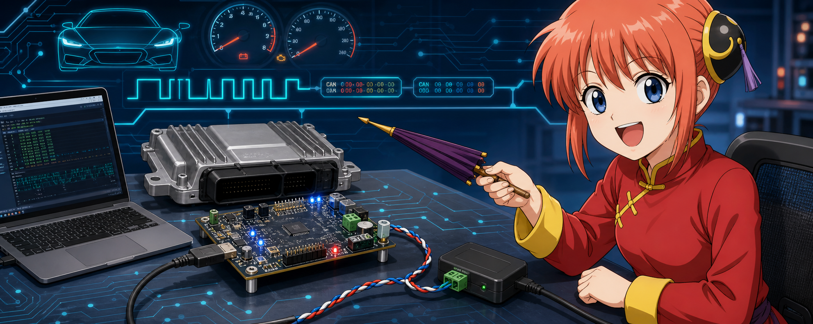
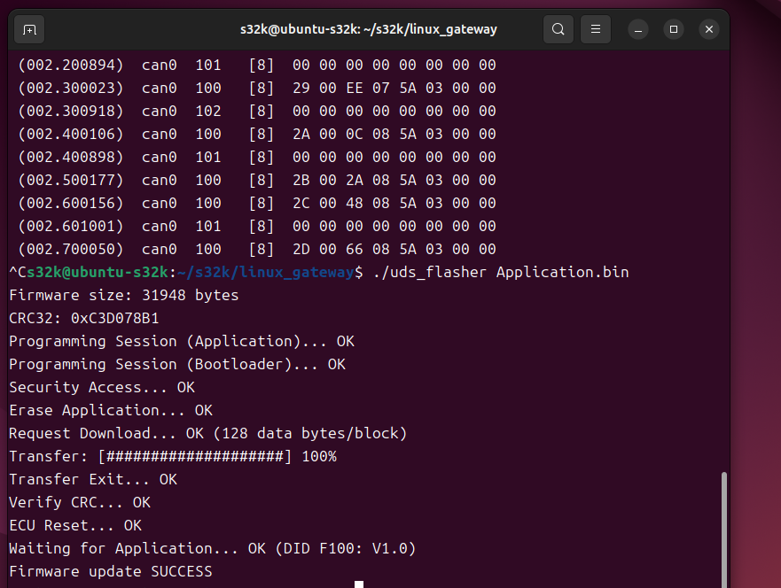
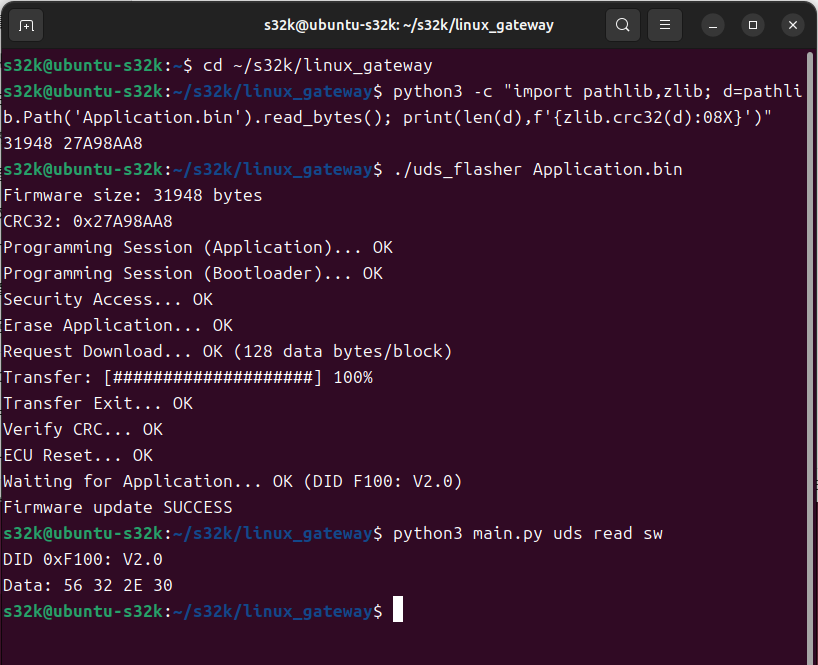
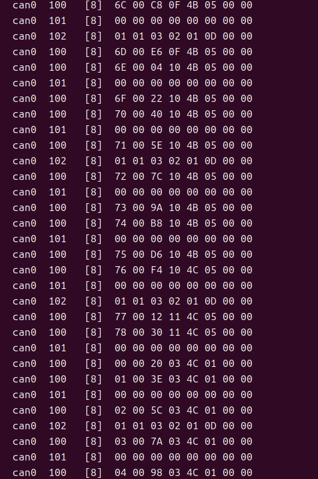
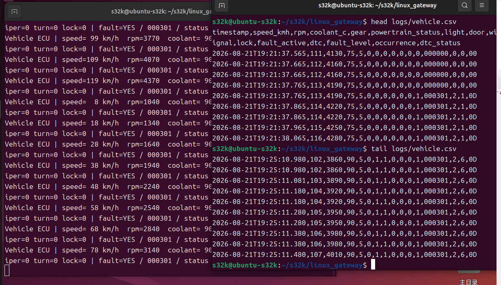

# S32K144 Bootloader V2 / Automotive ECU

## 当前验收状态：Stage5 PASS

已完成双槽升级、Trial/Confirm/Rollback、断电恢复及最终 PFlash 核验。
最终板上版本为 Slot A 22.0.0.0、Slot B 23.0.0.0，均 CONFIRMED，当前选择 B。
A22/B23 均通过脱离调试器的冷启动 CAN 查询。UJA1169 初始化包含 LPSPI
使能后写 TCR 的修复。按钮/复位映射仍作为独立待查项保留。

- [Stage5 硬件验收报告与证据](docs/bootloader_v2/stage5_acceptance_report.md)
- [产物 SHA-256 清单](docs/bootloader_v2/stage5_artifact_sha256.txt)
- [构建依赖与供应商文件恢复](docs/build_and_vendor_files.md)
- [第三方许可说明](THIRD_PARTY.md)

在 Windows PowerShell 中构建并运行回归（先配置脚本中的工具链路径）：

```powershell
./tools/build_stage5.ps1 -VersionA 22.0.0.0 -VersionB 23.0.0.0
```

产物位于 `Application_Build/Stage5/`。生成文件、完整 Flash 备份及受限供应商
文件不进入源码仓库；本地验收备份保留在 `Application_Build/`。
`uds_boot_status` 的 F105 查询仅用于 Bootloader 编程模式，应用运行时先通过
`10 02` 请求进入该模式。进行独立复位/冷启动验收时应断开调试器。

下面保留项目早期阶段和 V1 示例作为历史参考；当前 V2 以以上 Stage5 文档为准。

> 当前目录是独立的 **Bootloader V2** 开发副本，已加入 Inactive Slot 在线刷写和
> RAM Flash Driver、双副本 Update Journal 和复位恢复。第三阶段已由用户板上验收；
> 第四阶段的以下描述为历史记录。当前验收状态见上方 Stage5。以下单镜像示例属于 V1，不用于 V2 烧录。
> V2 使用 `tools/build_stage4.ps1` 构建、测试，产物在 `Application_Build/Stage4`。Linux 默认命令为
> `python3 uds_flasher app_slot_b_image.bin`（当前运行 A 时；反向更新使用 A 镜像）。
> 必须发送完整 packed image，且 Header 版本高于当前版本。
> 运行槽/镜像版本以 DID F101/F102 为准。详见
> [构建及启动流程](docs/bootloader_v2/boot_flow.md)、
> [驱动与刷写协议](docs/bootloader_v2/flash_driver.md)。
> 第一次安装第四阶段 Bootloader 后需显式初始化 Journal，不能直接沿用无 Journal 启动。
> 当前 B 5.0.0 基线的安装步骤见 [第四阶段验收](docs/bootloader_v2/stage4_test_matrix.md)。

<p align="center">
  
</p>

<p align="center">
  <b>一块会说 CAN、懂诊断、还能自己刷固件的 S32K144 小车 ECU。</b><br>
  FreeRTOS · AUTOSAR-like · UDS · ISO-TP · DEM · SocketCAN · CAN Bootloader
</p>

<p align="center">
  
  
  
  
  
</p>

---

## 👋 这是什么？

这是一个运行在 **NXP S32K144EVB** 上的汽车 ECU 原型。它把 MCU 应用、诊断栈、故障管理、Linux 上位机和 CAN Bootloader 串成了一条完整链路：

```text
Linux / SocketCAN
       │
       │  USB-CAN · Classical CAN 500 kbit/s
       ▼
┌──────────────────────────────────────┐
│              S32K144                 │
│                                      │
│  Bootloader ── UDS刷写 / CRC / 跳转   │
│       │                              │
│       ▼                              │
│  Application ─ FreeRTOS              │
│       ├─ CAN / COM                   │
│       ├─ ISO-TP / UDS                │
│       ├─ DEM / DTC                   │
│       └─ Vehicle Model               │
└──────────────────────────────────────┘
```

一句话概括：**Linux 发命令，S32K144 跑车辆模型；出现故障能诊断，需要升级时能通过 CAN 刷写。**

## ✨ 能做什么？

### 🚙 ECU Application

- FreeRTOS 多任务调度
- 500 kbit/s Classical CAN 通信
- 周期报文：`0x100` / `0x101` / `0x102`
- 控制报文：`0x200`
- 车辆速度、转速、水温、挡位和车身状态模拟
- 心跳监督与控制超时故障

### 🩺 UDS 与故障诊断

- ISO-TP 单帧和多帧传输
- UDS 请求/响应：`0x7E0` / `0x7E8`
- `0x10` DiagnosticSessionControl
- `0x22` ReadDataByIdentifier
- `0x19` ReadDTCInformation
- `0x14` ClearDiagnosticInformation
- VIN、软件版本、速度、转速、水温和挡位读取
- DEM 风格的 24 位 DTC 与状态位管理

### 🔧 CAN Bootloader

- Bootloader / Application Flash 分区
- Application 向量表、MSP 和入口地址校验
- UDS `0x27 / 0x31 / 0x34 / 0x36 / 0x37 / 0x11`
- SecurityAccess、擦除、下载、分块传输和复位
- CRC32 与固件元数据校验
- 断点失败、错误 CRC、错误块序号和越界地址保护
- Bootloader 到 Application 的可靠跳转

### 🐧 Linux Gateway

- SocketCAN 收发与车辆信号解析
- 终端实时监视和 CSV 日志
- Linux UDS Tester
- VIN 多帧自动接收
- 一条命令完成 Application 固件升级
- 不连接实车也能运行的 Python 单元测试

## 🗺️ Flash 布局

| 区域 | 起始地址 | 结束地址 | 用途 |
|---|---:|---:|---|
| Bootloader | `0x00000000` | `0x00007FFF` | 启动、诊断刷写和 Application 校验 |
| Application | `0x00008000` | `0x0007EFFF` | FreeRTOS ECU 应用 |
| Metadata | `0x0007F000` | `0x0007FFFF` | 大小、版本、CRC 和有效标志 |

更完整的地址说明见 [Flash map](docs/flash_map.md)。

## 🚀 Linux 快速体验

### 1. 安装工具

```bash
sudo apt update
sudo apt install -y python3 can-utils
cd linux_gateway
chmod +x uds_flasher scripts/*.sh
```

### 2. 启动 CAN

```bash
./scripts/setup_can.sh can0 500000
ip -details link show can0
candump -tz can0
```

正常情况下可以看到：

```text
can0  100  [8]  ...
can0  101  [8]  ...
can0  102  [8]  ...
```

### 3. 监视车辆状态

```bash
python3 main.py monitor
python3 main.py monitor --csv logs/vehicle.csv
```

### 4. 玩一下诊断

```bash
python3 main.py uds session extended
python3 main.py uds read sw
python3 main.py uds read vin
python3 main.py uds dtc read
```

### 5. 一键刷写 Application

```bash
./uds_flasher ../firmware/Application.bin
```

刷写器会依次完成：

```text
Programming Session → Security Access → Erase
        → Request Download → Transfer Data
        → CRC Verify → ECU Reset → Version Check
```

成功时会看到：

```text
Transfer: [####################] 100%
Verify CRC... OK
ECU Reset... OK
Waiting for Application... OK
Firmware update SUCCESS 🎉
```

## 🧪 已完成的实机验证

- 正常启动与 Bootloader 请求
- V1.0 → V2.0 CAN 固件升级
- 错误 CRC 拒绝与恢复刷写
- 中断刷写后的安全恢复
- 错误块序号、非法地址和未解锁刷写保护
- 断电重启后 Application 正常运行
- 升级后周期 CAN 报文恢复
- VIN ISO-TP 多帧接收
- DTC 触发、读取与清除
- `0x100 / 0x101 / 0x102` 周期约为 `100 / 200 / 500 ms`

### 📸 实机效果图

<p align="center">
  
  
</p>

<p align="center">
  <em>左：UDS CAN 刷写完成；右：复位后读取到 Application V2.0。</em>
</p>

<p align="center">
  
  
</p>

<p align="center">
  <em>左：SocketCAN 周期报文；右：Linux Gateway 车辆状态监视与 CSV 日志。</em>
</p>

完整记录见 [Bench test report](docs/test_report.md)。

## 🧰 构建

```bash
# Application
make -f Makefile.application all

# Bootloader
make -C Bootloader all

# 生成调试器首次烧录用组合镜像
python3 tools/package_firmware.py \
  --application-elf Application_Build/Application.elf \
  --application-bin Application_Build/Application.bin \
  --bootloader-elf Bootloader/build/Bootloader.elf \
  --output Application_Build/Combined_Firmware.elf \
  --version 0x00020000
```

构建需要 Arm GNU Toolchain，以及由本地 S32 Design Studio 安装提供的 NXP 设备支持文件。受许可限制的厂商文件没有放入公开仓库，详见 [Build & vendor files](docs/build_and_vendor_files.md)。

## 📁 仓库地图

```text
Bootloader/          CAN Bootloader 源码、链接脚本与配置
src/                 ECU Application 与 FreeRTOS 任务
include/             应用接口、FreeRTOS 与设备支持头文件
Project_Settings/    S32DS 启动代码与工程配置
linux_gateway/       SocketCAN、UDS Tester、刷写器与测试
tools/               固件元数据与组合镜像打包工具
docs/                架构、协议、构建与验收文档
firmware/            本地/Release 固件放置约定
images/              README 与实机演示图片
```

## 📚 文档

- [系统架构](docs/architecture.md)
- [启动流程](docs/boot_process.md)
- [Flash 布局](docs/flash_map.md)
- [Application UDS 诊断](docs/uds_diagnostics.md)
- [UDS 固件刷写](docs/uds_flashing.md)
- [Linux 工具](docs/linux_tools.md)
- [实机测试报告](docs/test_report.md)
- [构建与厂商文件说明](docs/build_and_vendor_files.md)

## ⚠️ 原型边界

这是用于学习、实验和作品展示的台架原型，并非量产安全系统：

- SecurityAccess 为演示算法，不具备量产密码学强度。
- 尚未声明通过功能安全、EMC、长时间压力或恶意报文模糊测试。
- 当前不包含安全启动、数字签名、加密、A/B 分区或 CAN FD。

## 📜 License

项目原创代码采用仓库 [LICENSE](LICENSE) 中描述的 scoped MIT 条款。FreeRTOS 和 NXP 相关组件保留其各自许可与声明，请阅读 [THIRD_PARTY.md](THIRD_PARTY.md)。

> Banner 为 AI 生成的非官方同人插画；《银魂》神乐角色权利归原权利方所有，该图片不包含在本项目 MIT 授权范围内。商业使用前请替换为原创角色素材。

---

<p align="center">
  <b>CAN 线接好了吗？那就开跑吧！🚗💨</b>
</p>
